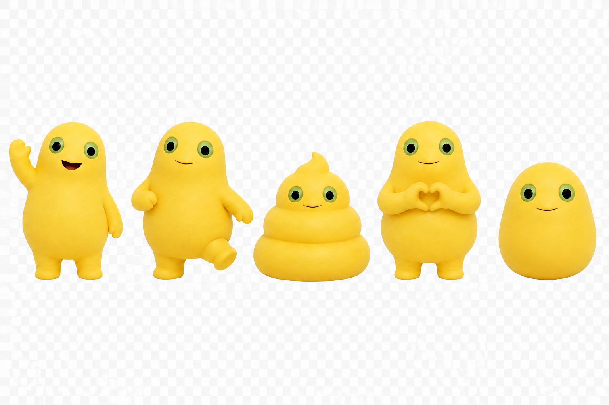
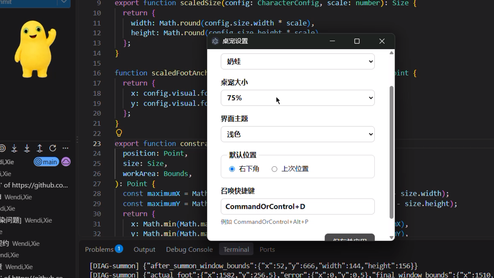

# DeskPet-naiLong

简体中文 | [English](./README.en.md)

一个用 Electron、TypeScript 和原生 HTML/CSS 编写的桌面宠物程序。现在支持奶蛙、噜噜、大奶蛙和罗小黑四个角色，也支持角色聊天、备忘录和到期提醒。

> 项目目前处于早期开发阶段，部分平台能力和视觉效果仍可能存在差异。

## 快速开始

### 环境要求

- Node.js 22 或更新版本
- npm
- Windows、macOS 或 Linux X11/XWayland

如果尚未安装 Node.js，可以从 [Node.js 官网](https://nodejs.org/en/download) 下载。

Windows 可以在 PowerShell 或命令提示符中执行：

```powershell
winget install --id OpenJS.NodeJS.LTS -e
```

### 安装并启动

```bash
npm install
npm start
```

依赖只会安装在本仓库的 `node_modules` 中，不需要全局安装 Electron。

## 当前功能

### 角色

可以在设置窗口中切换角色。每个角色拥有独立的动作、素材和聊天人格：

| 角色 | 特色 |
| --- | --- |
| 奶蛙 | 多种点击动作、目光跟随 |
| 噜噜 | 打招呼、跑步、摸头 |
| 大奶蛙 | 多种动画动作、目光跟随 |
| 罗小黑 | 打招呼、黑秀动作 |

角色差异通过配置接入，后续可以继续扩展角色和动作。

### 桌宠互动

- 点击桌宠，随机切换当前角色的点击动作；
- 支持鼠标拖拽移动桌宠；
- 当用户在其他应用中敲键盘时，桌宠会进入打字状态；停止键盘活动约 1.5 秒后恢复空闲；
- 使用快捷键将桌宠召唤到当前鼠标光标所在的位置；
- 部分角色在转头或注视状态下支持简单的目光跟随光标；
- 右键点击桌宠可以打开工具箱、设置或退出菜单。

<p align="center">
  
</p>

### 工具箱

- **角色聊天**：使用角色对应的人格设定进行聊天，支持流式回复和新建聊天；
- **备忘录**：创建、编辑、完成和删除待办事项；
- **到期提醒**：为待办设置日期或具体时间，到期时显示桌宠提醒卡片；不支持提醒动作的角色会回退为系统通知；
- **AI 配置**：支持 DeepSeek 和 OpenAI Compatible 服务，可填写 Base URL、Model 和 API Key。

<p align="center">
  
</p>

### 设置

右键点击桌宠并打开“设置”，可以修改：

- 当前角色；
- 桌宠大小；
- 浅色或深色界面主题；
- 默认出现在屏幕右下角，或恢复上次位置；
- 召唤快捷键。

<p align="center">
  
</p>

## 使用方式

启动后：

- 点击桌宠，触发当前角色的动作；
- 按住桌宠拖动，改变桌宠位置；
- 右键桌宠，在“工具箱”中打开聊天或备忘录；
- 默认按 `CommandOrControl+Alt+P`，将桌宠召唤到鼠标位置；
- 右键桌宠打开设置窗口，修改角色、大小、主题、位置和快捷键。

快捷键在不同系统上的对应关系：

| 系统 | 默认快捷键 |
| --- | --- |
| Windows | `Ctrl+Alt+P` |
| macOS | `Command+Option+P` |
| Linux | `Ctrl+Alt+P` |

### 配置角色聊天

1. 右键桌宠，选择“工具箱 > 聊天”；
2. 点击聊天窗口右上角的“设置”；
3. 选择 `DeepSeek` 或 `OpenAI Compatible`，填写 Base URL、Model 和 API Key；
4. 点击“测试连接”，确认成功后保存。

DeepSeek 可以使用 `https://api.deepseek.com` 作为 Base URL；其他兼容 OpenAI Chat Completions 的服务请使用服务商提供的地址。API Key 不会显示在设置快照中，应用会尝试使用系统安全存储保存它。

## 平台说明

目标平台是 Windows、macOS 和 Linux X11/XWayland，但目前开发和调试主要在 Windows 和 Linux 上进行，macOS 可能仍有兼容性问题。

- Windows、macOS 和 Linux X11/XWayland 支持完整的窗口移动和召唤流程；
- 全局键盘活动监听使用 `uiohook-napi`。macOS 首次使用时请在“系统设置 > 隐私与安全性 > 输入监控”（如系统列在“辅助功能”，也请允许）中允许本应用；应用只使用按键活动信号，不记录具体按键；
- Linux 原生 Wayland 不保证全局键盘活动监听，请使用 X11 或 XWayland；
- Linux 推荐使用 X11 或 XWayland。原生 Wayland 不保证程序化窗口定位、调整大小和逐帧移动；
- Debian/Ubuntu 如果启动时提示缺少系统库，可以安装：

  ```bash
  sudo apt install libgtk-3-0 libnss3 libasound2 libgbm1 libxss1 libxtst6 libnotify4 libatspi2.0-0
  ```

- 设置窗口的透明主题和系统材质属于平台相关的视觉增强，不保证所有系统显示一致；acrylic 系统材质目前只在 Windows 启用；
- 如果系统安全存储不可用，应用不会保存 AI API Key；
- macOS 关闭桌宠窗口后应用仍会保持运行，可以通过 Dock 重新激活；使用 `Command+Q` 退出应用。

## 开发与验证

运行测试、类型检查、构建和渲染检查：

```bash
npm test
npm run typecheck
npm run build
npm run test:render
```

打包当前平台的安装包：

```bash
npm run package
```

也可以使用 `npm run package:win`、`npm run package:mac` 或 `npm run package:linux` 指定目标平台。

### 角色素材

Python 3 和 Pillow 只在修改原始角色图片并重新生成透明 Sprite Sheet 时需要。

目录约定：

- `素材/<角色>/*`: 原始图片或角色素材；
- `素材/奶蛙/processed/*`: 奶蛙运行时读取的透明 Sprite Sheet；
- `素材/大奶蛙/processed/*`、`素材/罗小黑/processed/*`: 对应角色运行时读取的处理后素材；
- `*.processed.debug.png`: 带帧边界和锚点辅助线的预览图，不会被渲染器读取。

修改原始素材后，请运行对应的预处理脚本并确认角色配置中的 `frameCount` 与生成结果一致：

```bash
python -m pip install Pillow
python tools/preprocess_sprite.py --help
python tools/preprocess_sprite_test.py
```

部分 Linux/macOS 环境需要使用 `python3`；Windows 可以使用 `py -m pip` 和 `py tools/preprocess_sprite.py`。大奶蛙和罗小黑分别有 `tools/preprocess_danaiwa.py`、`tools/preprocess_xiaohei.py` 预处理脚本。

预处理脚本只在素材变更时运行；桌宠启动时不会重新生成角色素材。

## 项目文档

- [桌宠技术调研](./docs/research/desktop-pet-technology.md)
- [Electron 跨平台兼容性评估](./docs/research/cross-platform-electron.md)
- [README 结构参考](./docs/research/readme-patterns.md)

## 技术栈

- Electron 43
- TypeScript 5.8
- 原生 HTML/CSS
- Canvas Sprite Sheet 渲染
- OpenAI-compatible Chat Completions 服务接口

## 设计方向

角色差异由 `CharacterRegistry` 和 `CharacterConfig` 表达，角色人格由 `src/characters/personas/` 下的 Markdown 文件表达。窗口控制、桌宠移动、渲染和聊天服务职责保持分离。后续新增角色时，优先通过角色配置、角色素材和人格文件接入，而不是把角色判断散落到窗口和渲染逻辑中。
