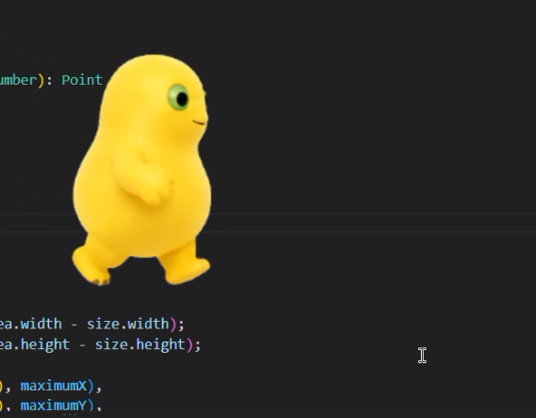

# DeskPet-naiLong

一个用 Electron、TypeScript 和原生 HTML/CSS 编写的桌面宠物。现在的主角是奶蛙：它会停留在桌面上，响应点击、拖拽和快捷键召唤。

> 项目目前处于早期开发阶段。当前角色为奶蛙，后续计划支持牛来、美团袋鼠和自定义角色。

## 快速开始

### 环境要求

- Node.js 22 或更新版本
- npm
- Windows、macOS 或 Linux X11/XWayland

如果尚未安装 Node.js，可以从 [Node.js 官网](https://nodejs.org/en/download) 下载

Windows 则可以在 PowerShell 或命令提示符中执行：
```powershell
winget install --id OpenJS.NodeJS.LTS -e
```


### 安装并启动

```bash
npm install
npm start
```

依赖只会安装在本仓库的 `node_modules` 中，不需要全局安装 Electron。

## 当前功能

- 奶蛙有不同的形态和动作，点击即可切换奶蛙动作；

<p align="center">
  
</p>

- 支持鼠标拖拽移动桌宠；

- 支持使用快捷键将桌宠召唤到当前鼠标光标所在的屏幕位置；

<p align="center">
  
</p>

- 在转头状态下，支持简单的目光跟随光标功能；

<p align="center">
  
</p>

- 右键点击桌宠可打开设置窗口，可修改角色、桌宠大小、默认位置和召唤快捷键。

<p align="center">
  
</p>

## 使用方式

启动后：

- 点击奶蛙，随机切换动作；
- 按住奶蛙拖动，改变桌宠位置；
- 默认按 `CommandOrControl+Alt+P`，将桌宠召唤到鼠标位置；
- 右键奶蛙，打开设置窗口。

快捷键在不同系统上的对应关系：

| 系统 | 默认快捷键 |
| --- | --- |
| Windows | `Ctrl+Alt+P` |
| macOS | `Command+Option+P` |
| Linux | `Ctrl+Alt+P` |

## 平台说明

目标平台是 Windows、macOS 和 Linux X11/XWayland，但是目前开发和调试都只是在win和linux上尝试过，mac可能会有bug。

- Windows、macOS 和 Linux X11/XWayland 支持完整的窗口移动和召唤流程；
- Linux 推荐使用 X11 或 XWayland。原生 Wayland 不保证程序化窗口定位、调整大小和逐帧移动；
- Debian/Ubuntu 如果启动时提示缺少系统库，可以安装：

  ```bash
  sudo apt install libgtk-3-0 libnss3 libasound2 libgbm1 libxss1 libxtst6 libnotify4 libatspi2.0-0
  ```

- 设置窗口的透明主题和系统材质属于平台相关的视觉增强，不保证所有系统显示一致；acrylic 系统材质目前只在 Windows 启用；
- macOS 关闭桌宠窗口后应用仍会保持运行，可以通过 Dock 重新激活；使用 `Command+Q` 退出应用。

## 开发与验证

运行测试、类型检查和构建：

```bash
npm test
npm run typecheck
npm run build
```

只有修改 `素材/奶蛙` 下的原始蓝幕图片并重新生成透明 Sprite Sheet 时，才需要 Python 3 和 Pillow。

素材目录约定如下：

- `素材/奶蛙/*.png`：原始蓝幕素材，只作为预处理输入，不被 renderer 直接读取；
- `素材/奶蛙/processed/*.processed.png`：运行时读取的透明 Sprite Sheet；
- `素材/奶蛙/processed/*.processed.debug.png`：带帧边界和锚点辅助线的预览图，不被 renderer 读取；
- `素材/奶蛙/processed/all-states.gif`：当前 idle 动作直接使用的成品 GIF。

修改原始素材后，需要重新生成对应的 processed 文件，并确认帧数与角色配置中的 `frameCount` 一致：

```bash
python -m pip install Pillow
python tools/preprocess_sprite.py --help
python tools/preprocess_sprite_test.py
```

部分 Linux/macOS 环境需要使用 `python3`；Windows 可使用 `py -m pip` 和 `py tools/preprocess_sprite.py`。

预处理脚本只在素材发生变化时运行；桌宠启动时不会调用该脚本，也不会从原始蓝幕图片重新生成角色素材。

## 项目文档

- [启动与验证指令](./启动指令.md)
- [桌宠技术调研](./docs/research/desktop-pet-technology.md)
- [Electron 跨平台兼容性核查](./docs/research/cross-platform-electron.md)
- [README 结构参考](./docs/research/readme-patterns.md)

## 技术栈

- Electron 43
- TypeScript 5.8
- 原生 HTML/CSS
- Canvas Sprite Sheet 渲染

## 设计方向

角色差异由 `CharacterRegistry` 和 `CharacterConfig` 表达，窗口控制、桌宠移动和渲染职责保持分离。后续新增角色时，优先通过角色配置接入，而不是把角色判断散落到窗口和渲染逻辑中。
